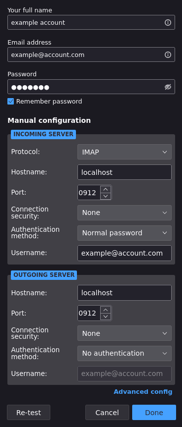
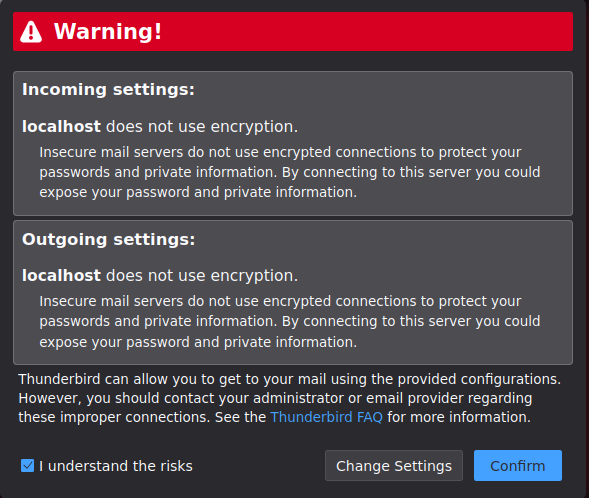

## Back up your IMAP mailboxes with ease!

<!-- vim-markdown-toc GFM -->

* [General](#general)
    * [Notable features](#notable-features)
    * [Currently absent features](#currently-absent-features)
* [Why a re-implementation](#why-a-re-implementation)
* [How to use](#how-to-use)
    * [Note for Windows users](#note-for-windows-users)
    * [Store password in keyring](#store-password-in-keyring)
    * [List folders](#list-folders)
    * [Download](#download)
    * [Serve](#serve)
* [Installation](#installation)
    * [Tab completion](#tab-completion)
* [How to contribute](#how-to-contribute)
* [Licence](#licence)

<!-- vim-markdown-toc -->

# General


This is `go-imapgrab`, a re-implementation of the amazing [`imapgrab`][imapgrab]
in plain Golang.
It is a command line application that can be used to make a local backup of your
IMAP mailboxes.
See [below](#how-to-use) for how to use.

This software is in a stable state and has been used by the main author to back
up quite a few mailboxes already.
Development started in early 2022.
Contributions are very welcome (see below)!
Features will be added on occasion and dependencies will be kept up to date as
needed, especially in the case of known vulnerabilities.

## Notable features

- download IMAP mailboxes to a local directory following the
  [`maildir`][maildir] format
- browse local backups with your favourite email client
- download folders in parallel
- static binary without any additional dependencies
- support for system keyring to store credentials securely
- maildir output fully compatible to the original [`imapgrab`][imapgrab] (please
  open an issue in this repository if you notice incompatibilities)
- tab completion for many shells

## Currently absent features

Contributions to these would be welcome.
Please reach out before starting to work on any of them.

- output in other formats such as `mbox`
- password specification via command line argument (use environment variable or
  keyring for now)
- more than two verbosity levels
- disabling SSL for connections
- change user for download (cf. [`imapgrab`][imapgrab]'s `--localuser` flag) to
  be runnable as `root` (use `sudo` instead to change the user for one
  invocation)
- restoration of a local backup to a server
- local removal of emails that have been removed remotely
- a graphical user interface
- download a single folder with multiple threads

# Why a re-implementation

The main author had been using the original [`imapgrab`][imapgrab] successfully
for quite a while to backup mailboxes.
However, the original is implemented in the deprecated Python version 2 and has
been abandoned.
While there are re-implementations in Python 3, none of them appeared quite
complete at the time this project started.

In addition to the above, [`imapgrab`][imapgrab] uses the [`getmail`][getmail]
executable to download emails.
That executable is also written in Python 2 and lacked a complete
re-implementation in Python 3 at the time this project started.

Furthermore, the author had started learning Golang not too long before this
project started.
Golang is a language that provides static binaries while supporting
cross-compilation natively.
One advantage of such a setup is that it is very easy to provide executables for
systems that would run [`imapgrab`][imapgrab] or [`getmail`][getmail] only with
difficulty.
Thus, `go-imapgrab` seemed like a project that is useful while providing
opportunities to learn.

Still, this project would not have been possible without the amazing tools
[`imapgrab`][imapgrab] and [`getmail`][getmail], which provided a very solid
basis for `go-imapgrab`.
Thank you!

# How to use

First, you need to download and install the binary.
See [installation](#installation) below for details.
Once you have the executable, run `go-imapgrab --help` to see whether it works.
Please open an issue in this repository if you experience problems!

A typical workflow consists of the following four steps:

- store the password for your account in your keyring (optional but recommended)
- list the folders in your mailbox
- download the ones you wish to back up
- view locally stored emails using your favourite email client

## Note for Windows users

❗ If you are on Windows, replace any invocation of `go-imapgrab` by
`go-imapgrab.exe`.
This document will omit the `.exe` extension throughout. ❗

## Store password in keyring

You can store your password in your system's keyring to avoid having to define
an environment variable every time you invoke `go-imapgrab`.
To do so, simply run the following command:

```bash
go-imapgrab login -u "${USERNAME}" -s "${SERVER}" -p "${PORT}"
```

Then, enter your password at the prompt.
Note that the password will not be echoed as you type.

The specification of the port it optional, it defaults to 993.
Refer to the documentation of your email provider for the username, server, and
port.
For Gmail, you can:

- use an [application-specific password][gmail-app-password] as password
- provide your email address as `${USERNAME}`
- use `imap.gmail.com` as `${SERVER}`
- leave out the port since Gmail uses the default one

The password needs to be specified only once.
Every subsequent call to the `list`, `download`, or `serve` commands will use
the system's keyring if you do not disable it.

To see the full specification for the `login` command, run:

```bash
go-imapgrab login --help
```

## List folders

Usually, the first step after storing the password in your keyring is to list
the folders available in your mailbox.
If you did not store the password in your system keyring, you have to assign its
value to an environment variable called `IGRAB_PASSWORD`.
On Unix-like systems, the following command is usually sufficient:

```bash
export IGRAB_PASSWORD="${PASSWORD}"
```

To list folders in your mailbox, run:

```bash
go-imapgrab list -u "${USERNAME}" -s "${SERVER}" -p "${PORT}"
```

To disable the keyring, for example if you experience problems or don't have a
keyring, add the `--no-keyring` flag.
You will need to provide your password via the environment variable in that
case.

Once you see your list of folders, decide which ones you want to download and
proceed with the `download` command (see below).

To see the full specification for the `list` command, run:

```bash
go-imapgrab list --help
```

## Download

The next step is to download the folders you want.
For example, to download all folders apart from Gmail-specific ones and the
`Drafts` directory, you can run:

```bash
go-imapgrab download -u "${USERNAME}" -s "${SERVER}" -p "${PORT}" \
    -f _ALL_ -f -_Gmail_ -f -Drafts --path "${LOCALPATH}"
```

For the first run for a mailbox, specify for `${LOCALPATH}` a non-existing or
empty directory.
This is where you will download all folders for this mailbox to.
The directory will be created first if it doesn't exist, including all parents.

The above command will result in one directory per folder in `${LOCALPATH}` in
addition to one meta data file per folder that must not be modified or updates
won't work.
For every run after the first, specify the very same `${LOCALPATH}` if you want
to download only missing emails.

As you can see in the above command, you can provide multiple folder
specifications via the `-f` or `--folder` flag.
They are evaluated in order.
A folder specification is either

- a literal folder name such as `Drafts` in the above example
- the literal string `_ALL_` to specify all folders
- the literal string `_Gmail_` to specify all Gmail-specific folders

A folder specification can optionally start with a minus sign (`-`), in which
case it negates the specification.
Thus, `-Drafts` in the above example deselects that folder, while `_ALL_`
selects all folders first.

These folder specifications have been taken from [`imapgrab`][imapgrab].
In contrast, though, multiple folders are not separated by commas but the
`--folder` flag can be provided several times instead.

By default, all folders will be downloaded in parallel using one thread per
folder.
The implementation of that feature required one login to the IMAP server for
each download thread because of a dependency.
Your email provider may disallow multiple logins in quick succession.
Thus, you may want to use the `--threads` flag to limit the number of logins and
thus threads downloading in parallel.
Parallel downloads are most useful for initial syncs.

To see the full specification for the `download` command, run:

```bash
go-imapgrab download --help
```

## Serve

### Using the mutt command line client

There are several options to view your locally backed up emails.
If you have access to the `mutt` email client, in order to view emails for a
folder in your mailbox called `${FOLDER}`, you can run

```bash
mutt -f ${LOCALPATH}/${FOLDER}
```

Make sure to specify the very same `${LOCALPATH}` that you specified when
running the `download` command.


### Using any email client

Unfortunately, only very few email clients support viewing locally stored
emails.
To work around that limitation, `go-imapgrab` can run as a fully-local
read-only IMAP server that any IMAP-compatible email client can connect to.
Here, fully local means that only programs on the same machine as the one
running `go-imapgrab` can connect to it.

The following example assumes you are using the Thunderbird email client.
The first step is to launch `go-imapgrab` as a local IMAP server.
To do so, run the following command:

```bash
go-imapgrab download -u "${USERNAME}" -s "${SERVER}" -p "${PORT}" \
    --path "${LOCALPATH}"
```

Make sure to specify the exact same values for `${USERNAME}`, `${SERVER}`,
`${PORT}`, and  `${LOCALPATH}` as you did for the `download` command for the
mailbox you wish to view.
By default, the IMAP server will listen for incoming connections on port 30912
on your local machine.

Then, launch your email client and *manually* configure an email account that:

- uses the IMAP protocol
- does not use encryption
- uses `localhost` as host/server
- uses the same username and password as the email account you wish to view
- uses the port 30912 (or another one if specified via the `--server-port` flag)

For Thunderbird, that would look like this (note that the first digit of the
port number is obscured):



Note that you may have to accept the risk of using an unencrypted connection.
As the IMAP server will only accept connections from your local machine, this is
acceptable on single-user systems.
For Thunderbird, that warning would look like this:



If your email client requires you to specify an outgoing email server, use the
same as for incoming email.

To see the full specification for the `serve` command, run:

```bash
go-imapgrab serve --help
```

### A note on ports

Only one service can listen on the same port.
Thus, if you wish to view multiple mailboxes at the same time, specify a
different port for every invocation of the `serve` command using the
`--server-port "${SERVERPORT}"` flag.

# Installation

Go to the project's [release page][release-page], select the correct
distribution for your system, and download it.
Extract the downloaded archive and move the extracted binary to a location that
is in your `$PATH` such as `/usr/local/bin`.
Moving it there will likely require `root` permissions, e.g. via `sudo`.
From now on, you can simply type `go-imapgrab` in your terminal to use it!

## Tab completion

If you want to set up tab completion for your shell, add the following to your
shell's configuration file:

- `bash`: add to `~/.bashrc`:
  ```bash
  [[ -x $(command -v go-imapgrab) ]] && eval "$(go-imapgrab completion bash)"
  ```
- `zsh`: add to `~/.zshrc`:
  ```zsh
  [[ -x $(command -v go-imapgrab) ]] && eval "$(go-imapgrab completion zsh)"
  ```
- `fish`: add to `~/.config/fish/config.fish`:
  ```fish
  if type -q go-imapgrab
    eval (go-imapgrab completion fish)
  end
  ```

Using tab completion requires adding `go-imapgrab` to a directory in your
`$PATH`.

# How to contribute

If you have found a bug and want to fix it, please simply go ahead and fork the
repository, fix the bug, and open a pull request to this repository!
Bug fixes are always welcome.

In all other cases, please open an issue on GitHub first to discuss the
contribution.
The feature you would like to introduce might already be in development.

# Licence

[GPLv3](./LICENCE)

If you want to use this piece of software under a different, more permissive
open-source licence, please contact me.
I am very open to discussing this point.

[imapgrab]: https://sourceforge.net/p/imapgrab/wiki/Home/ "imapgrab website"
[maildir]: https://cr.yp.to/proto/maildir.html "maildir format"
[getmail]: https://pyropus.ca./software/getmail/ "getmail website"
[gmail-app-password]: https://support.google.com/accounts/answer/185833?hl=en "application-specific passwords"
[release-page]: https://github.com/razziel89/go-imapgrab/releases/latest "latest release"
